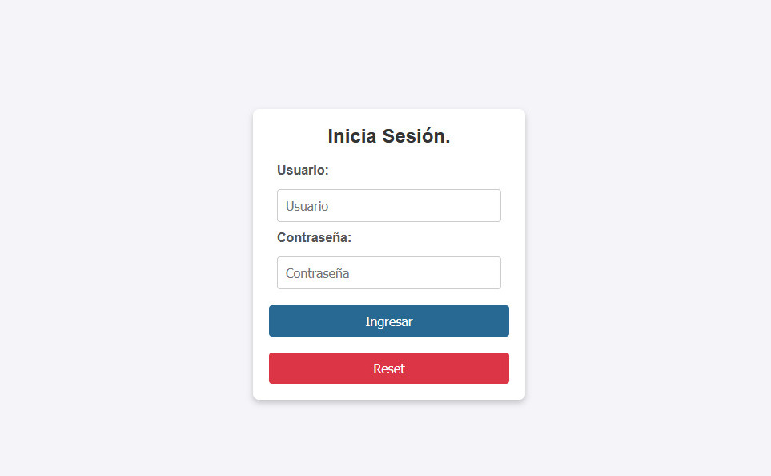

# Proyecto: final3f - Grupo 12 - SPRINT

## Descripción
En este proyecto se desarrolla un CRUD con LOGIN usando una API.

## Instalación
1. Crea una carpeta en htdocs, por ejemplo 'final3f/'

1. Clona el repositorio en esta carpeta:
   ```bash
    git clone https://github.com/Mauriciogez82/final3f.git 

3. Dentro de la carpeta del proyecto (login/), abrir una terminal y ejecuta el archivo que crea la base de datos
   ```bash
    php crear_base_datos.php

4. En una direccion similar a: http://localhost/final3f/login/ podrás ver

   
   
